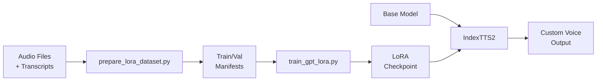

# LoRA Fine-Tuning for IndexTTS

Train IndexTTS on your custom voice with minimal data and computational resources using LoRA (Low-Rank Adaptation).

## 📁 Project Structure

All training data, checkpoints, and outputs are organized under `training/{speaker_name}/`:

```
training/
  {speaker_name}/
    dataset/
      audio/                 # Raw audio files (.wav)
      transcripts.csv        # Transcriptions (audio_path,text)
      processed/             # After running prepare_lora_dataset.py
        train_manifest.jsonl
        val_manifest.jsonl
        features/            # Pre-extracted features
    embeddings/
      speaker_embeddings.pt  # Speaker embeddings (extract after training)
    lora/
      final_checkpoint/      # LoRA adapter weights
      logs/                  # TensorBoard logs
    finetune/
      best_model.pth         # Full finetune checkpoint
      logs/                  # TensorBoard logs
    outputs/                 # Generated audio files
      comparison/            # Model comparison outputs
```

## � What's New

IndexTTS now supports **LoRA fine-tuning** for efficient voice adaptation:

- ✅ **Fast Training**: 1-4 hours on consumer GPUs
- ✅ **Minimal Data**: 50-500 audio samples (2-20 minutes)
- ✅ **Small Checkpoints**: ~1-10 MB vs ~1 GB full model
- ✅ **High Quality**: Preserves base model while adapting voice
- ✅ **Easy Switching**: Multiple voices, one base model

## 📚 Documentation

- **[Quick Start Guide](docs/LORA_QUICKSTART.md)** - Get started in 10 minutes
- **[Complete Training Guide](docs/lora_training_guide.md)** - Detailed documentation
- **[Example Config](configs/lora_finetune_example.yaml)** - Reference configuration

## 🎯 Quick Example (Using Standard Structure)

### 1. Setup your speaker directory

```bash
mkdir -p training/my_voice/dataset/audio
# Copy your audio files (.wav) to training/my_voice/dataset/audio/
# Create training/my_voice/dataset/transcripts.csv with format: audio_path,text
```

### 2. Prepare Data

```bash
python tools/prepare_lora_dataset.py \
  --audio-dir training/my_voice/dataset/audio \
  --transcripts training/my_voice/dataset/transcripts.csv \
  --output-dir training/my_voice/dataset/processed
```

### 3. Train LoRA

```bash
python tools/train_gpt_lora.py \
  --train-manifest training/my_voice/dataset/processed/train_manifest.jsonl \
  --val-manifest training/my_voice/dataset/processed/val_manifest.jsonl \
  --output-dir training/my_voice/lora \
  --epochs 20 \
  --batch-size 8 \
  --lora-rank 8 \
  --amp
```

### 4. Extract Speaker Embeddings (IMPORTANT!)

After training, you **must** extract speaker embeddings:

```bash
python tools/extract_embeddings.py --speaker my_voice
```

### 5. Compare Base vs Trained Model

```bash
python tools/compare_models.py --speaker my_voice --text "Hello, this is a test."
```

### 6. Run Inference

```bash
# Simple inference (auto-uses embeddings & best available model)
python tools/infer.py --speaker my_voice --text "Hello, this is my custom voice!"

# Or in Python:
```

```python
from indextts.infer_v2 import IndexTTS2
from indextts.speaker_embeddings import SpeakerEmbeddingStore

# Load model with LoRA
tts = IndexTTS2(lora_path="training/my_voice/lora/final_checkpoint")

# Load stored speaker embeddings
store = SpeakerEmbeddingStore(tts)
speaker_embeddings = store.load_embeddings("training/my_voice/embeddings/speaker_embeddings.pt")

# Run inference with stored embeddings (NOT reference audio!)
tts.infer(
    spk_audio_prompt=None,  # Not needed!
    text="Hello, this is my custom voice!",
    output_path="output.wav",
    speaker_embeddings=speaker_embeddings  # Use stored embeddings
)
```

> ⚠️ **CRITICAL**: See [Why Speaker Embeddings Are Required](#-why-speaker-embeddings-are-required) below!

## 📊 Data Requirements

| Dataset Size | Samples | Duration | Use Case |
|--------------|---------|----------|----------|
| Minimal | 50-100 | 2-5 min | Testing, proof of concept |
| Recommended | 200-500 | 10-20 min | Production quality |
| Optimal | 1000+ | 30+ min | Best quality, multiple styles |

## 🔧 Key Features

### Efficient Training

- **Parameter-efficient**: Trains <1% of model parameters
- **Memory-efficient**: Fits on 8GB GPUs
- **Time-efficient**: 10-100x faster than full fine-tuning

### Flexible Architecture

- **Configurable rank**: Adjust capacity vs speed
- **Target module selection**: Control which layers adapt
- **Multiple LoRA support**: Train different voices separately

### Production Ready

- **Easy deployment**: Load LoRA at inference time
- **Model merging**: Optional merge for single-file deployment
- **Checkpoint management**: Auto-save, train resuming

## 🛠️ Tools Provided

| Tool | Purpose |
|------|---------|
| [`tools/prepare_lora_dataset.py`](tools/prepare_lora_dataset.py:1) | Convert audio + text → training manifests |
| [`tools/train_gpt_lora.py`](tools/train_gpt_lora.py:1) | LoRA fine-tuning script |
| [`tools/train_gpt_finetune.py`](tools/train_gpt_finetune.py:1) | Full GPT fine-tuning script |
| [`tools/extract_embeddings.py`](tools/extract_embeddings.py:1) | **Extract speaker embeddings from training data** |
| [`tools/compare_models.py`](tools/compare_models.py:1) | **Compare base vs finetuned model outputs** |
| [`tools/infer.py`](tools/infer.py:1) | **Simple inference with trained models** |
| [`indextts/utils/lora_utils.py`](indextts/utils/lora_utils.py:1) | LoRA utilities (load, save, merge) |
| [`indextts/speaker_embeddings.py`](indextts/speaker_embeddings.py:1) | Speaker embedding storage for promptless inference |

## 🔬 Easy Model Comparison

After training, use the comparison tool to evaluate your model:

```bash
# Simple: Just specify the speaker name (auto-resolves all paths!)
python tools/compare_models.py --speaker goldblum --text "Hello, this is a test."

# Or with explicit paths:
python tools/compare_models.py \
  --text "Hello, this is a test of my trained voice." \
  --embeddings training/my_voice/embeddings/speaker_embeddings.pt \
  --lora training/my_voice/lora/final_checkpoint \
  --output-dir training/my_voice/outputs/comparison

# List all available speakers
python tools/compare_models.py --list-speakers
```

This generates:
1. `*_1_base_*.wav` - Base model output (no training)
2. `*_2_lora_*.wav` - LoRA model output (if LoRA exists)
3. `*_3_finetuned_*.wav` - Full finetune output (if finetune exists)
4. `*_comparison_summary.txt` - Summary of all generated files

**Listen to these files to hear the actual differences!**

## 📖 Training Workflow



## ⚠️ Why Speaker Embeddings Are Required

### The Two-Stage Pipeline Problem

IndexTTS2 uses a two-stage TTS pipeline:

```
┌──────────────────────────────────────────────────────────────────────┐
│ Stage 1: GPT Model (Trainable with LoRA)                             │
│   Input: Text + Speaker Conditioning + Emotion Conditioning          │
│   Output: Semantic Tokens                                            │
│   ✅ This is what LoRA trains!                                       │
└──────────────────────────────────────────────────────────────────────┘
                              ↓
┌──────────────────────────────────────────────────────────────────────┐
│ Stage 2: S2Mel + BigVGAN (NOT trained)                               │
│   Input: Semantic Tokens + Reference Audio Features                  │
│   Output: Audio Waveform                                             │
│   ⚠️ Uses ref_mel, style, prompt_condition from reference audio!    │
└──────────────────────────────────────────────────────────────────────┘
```

### The Problem

Even if your GPT model learns voice patterns through LoRA/finetuning, **the S2Mel stage uses features extracted from the reference audio you provide at inference time**. This means:

- If you pass a random reference audio (`spk_audio_prompt="reference.wav"`), the final voice timbre will be dominated by THAT audio, NOT what the model learned
- This is why you might not hear any difference between base and finetuned models!

### The Solution

Store speaker embeddings from your training data, then use them during inference:

```python
# WRONG: Reference audio overrides trained voice!
tts.infer(spk_audio_prompt="any_audio.wav", text="Hello", output_path="out.wav")

# CORRECT: Use stored embeddings from training data!
tts.infer(
    spk_audio_prompt=None,
    text="Hello",
    output_path="out.wav",
    speaker_embeddings=speaker_embeddings  # Contains: spk_cond_emb, style, prompt_condition, ref_mel
)
```

### What Gets Stored

The `speaker_embeddings` dictionary contains:

| Key | Shape | Purpose |
|-----|-------|---------|
| `spk_cond_emb` | `[1, T, 1024]` | Speaker conditioning for GPT |
| `style` | `[1, 192]` | CAMPPlus speaker style for S2Mel |
| `prompt_condition` | `[1, T', 768]` | Reference for S2Mel generation |
| `ref_mel` | `[1, 128, T'']` | Mel spectrogram for S2Mel CFM |
| `emo_cond_emb` | `[1, T, 1024]` | Emotion conditioning (usually same as spk) |

### Comparison Script

Use the comparison script to verify the difference:

```bash
python examples/finetuned_inference_example.py --compare \
  --embeddings trained_lora/my_voice/speaker_embeddings.pt \
  --audio my_voice/sample.wav \
  --lora trained_lora/my_voice/final_checkpoint \
  --text "This is a test of the trained voice" \
  --output comparison_output.wav
```

This generates three files:
1. `*_base_with_ref.wav` - Base model with reference audio
2. `*_finetuned_with_ref_WRONG.wav` - Finetuned model with reference audio (sounds similar to #1!)
3. `*_finetuned_with_embeddings_CORRECT.wav` - Finetuned model with stored embeddings (trained voice!)

## 💡 Use Cases

1. **Personal Voice Clone**: Create your digital voice
2. **Character Voices**: Train different character voices for games/apps
3. **Language Adaptation**: Adapt to new languages/accents
4. **Style Transfer**: Change speaking style while preserving content
5. **Voice Restoration**: Restore or modify archived voices

## 🎓 Best Practices

### Data Collection

- Record in quiet environment
- Use consistent equipment
- Maintain natural speaking style
- Cover diverse phonemes and sentences

### Training

- Start with default hyperparameters
- Monitor training/validation losses
- Save checkpoints frequently
- Test intermediate checkpoints

### Deployment

- Compare multiple checkpoints
- Test with diverse inputs
- Document training settings
- Version control your LoRAs

## 🔍 Hyperparameter Guide

| Parameter | Default | Range | Effect |
|-----------|---------|-------|--------|
| `lora-rank` | 8 | 4-16 | Adapter capacity |
| `learning-rate` | 3e-4 | 1e-4 to 5e-4 | Training speed |
| `batch-size` | 8 | 2-16 | Memory vs speed |
| `epochs` | 20 | 10-30 | Training duration |

Adjust based on:
- Dataset size (larger → higher rank, more epochs)
- GPU memory (less → smaller batch, use grad accumulation)
- Quality needs (higher → more epochs, larger rank)

## 🐛 Troubleshooting

### Common Issues

**Out of Memory**
```bash
# Solution: Reduce batch size, add gradient accumulation
--batch-size 4 --grad-accumulation 4
```

**Training Loss Not Decreasing**
```bash
# Solution: Increase learning rate or rank
--learning-rate 5e-4 --lora-rank 12
```

**Generated Voice Doesn't Match Target**
```bash
# Solutions:
# 1. Train longer
--epochs 30
# 2. Use more data (add more samples)
# 3. Increase rank
--lora-rank 12
```

See [full troubleshooting guide](docs/lora_training_guide.md#troubleshooting)

## 🔬 Advanced Features

### Merge LoRA into Base Model

```python
from indextts.utils.lora_utils import merge_lora_weights

merged_model = merge_lora_weights(
    lora_model,
    output_path="checkpoints/my_voice_merged.pth"
)
```

### Train on Multiple Datasets

```bash
python tools/train_gpt_lora.py \
  --train-manifest data/voice1/train.jsonl \
  --train-manifest data/voice2/train.jsonl \
  --val-manifest data/voice1/val.jsonl \
  --val-manifest data/voice2/val.jsonl \
  --output-dir trained_lora/multi_voice
```

### Custom Target Modules

```bash
python tools/train_gpt_lora.py \
  --lora-target-modules "gpt.h.*.attn.c_attn" "mel_head" \
  # ... other args
```

## 📈 Performance Benchmarks

Tested on RTX 3080 (10GB VRAM):

| Dataset Size | Training Time | Checkpoint Size | Quality |
|--------------|---------------|-----------------|---------|
| 100 samples | 1-2 hours | ~3 MB | Good |
| 300 samples | 2-3 hours | ~5 MB | Excellent |
| 1000 samples | 3-4 hours | ~8 MB | Outstanding |

## 🤝 Contributing

Improvements welcome! Areas of interest:
- Multi-GPU training support
- Training resume functionality
- Automatic hyperparameter tuning
- More target module presets

## 📝 License

Same as IndexTTS base project.

## 🙏 Acknowledgments

- **PEFT Library**: https://github.com/huggingface/peft
- **LoRA Paper**: [LoRA: Low-Rank Adaptation of Large Language Models](https://arxiv.org/abs/2106.09685)
- **IndexTTS Team**: Base model and architecture

## 📞 Support

- **Documentation**: [Training Guide](docs/lora_training_guide.md)
- **Quick Start**: [Quick Start Guide](docs/LORA_QUICKSTART.md)
- **Issues**: GitHub Issues
- **Discussions**: GitHub Discussions

---

**Happy Training! 🎙️✨**